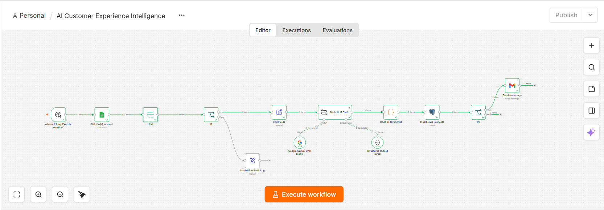
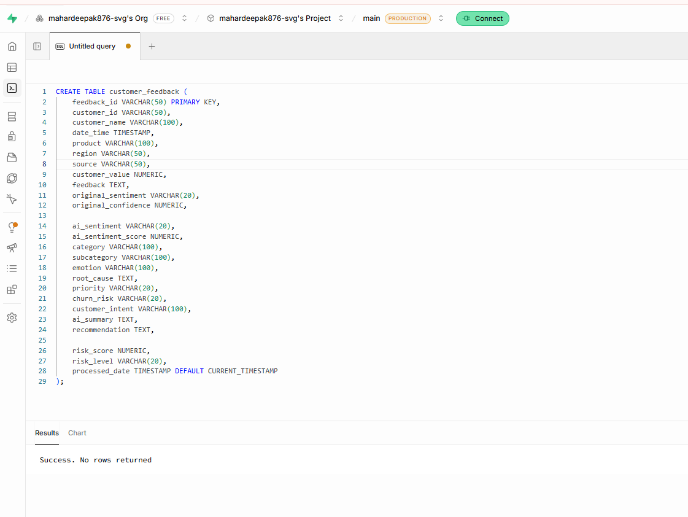
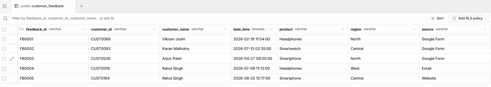
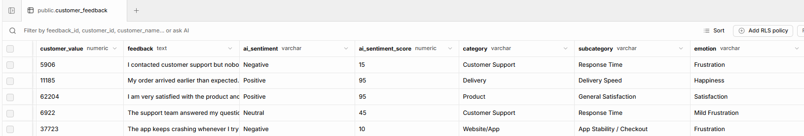
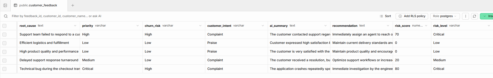
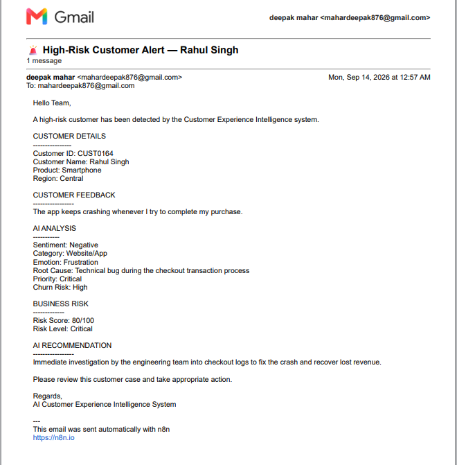

# 🤖 AI Customer Experience Intelligence

An **AI-powered customer feedback analysis and customer-risk intelligence system** built using **n8n, Google Gemini, and Supabase PostgreSQL**.

The system automatically processes customer feedback, uses AI to analyze sentiment and identify customer risk, stores structured insights in a PostgreSQL database, and sends automated alerts when high-risk feedback is detected.

---

## 📌 Project Overview

Customer feedback contains valuable information about customer satisfaction, product issues, and potential customer churn.

Manually analyzing large volumes of feedback can be time-consuming and inconsistent.

This project automates the complete feedback intelligence workflow:

**Customer Feedback → Data Validation → AI Analysis → Risk Detection → Database Storage → Email Alert**

The workflow uses **Google Gemini** to transform unstructured customer feedback into structured business insights.

---

## 🎯 Objectives

* Automate customer feedback analysis
* Identify customer sentiment
* Detect potential customer risks
* Extract important issues and insights
* Store structured analysis in a database
* Automatically alert teams about high-risk customers
* Reduce manual feedback analysis
* Enable data-driven customer experience decisions

---

## 🏗️ System Architecture

```text
                 Customer Feedback
                        │
                        ▼
                ┌───────────────┐
                │  n8n Workflow │
                └───────┬───────┘
                        │
                        ▼
                ┌───────────────┐
                │ Data Validation│
                └───────┬───────┘
                        │
                        ▼
                ┌────────────────┐
                │ Google Gemini  │
                │  AI Analysis   │
                └───────┬────────┘
                        │
                        ▼
             ┌─────────────────────┐
             │ Structured Customer │
             │     Insights        │
             └──────────┬──────────┘
                        │
             ┌──────────┴──────────┐
             ▼                     ▼
     ┌────────────────┐     ┌───────────────┐
     │ Supabase       │     │ Risk Detection│
     │ PostgreSQL     │     └───────┬───────┘
     └────────────────┘             │
                                    ▼
                            ┌────────────────┐
                            │ Email Alert    │
                            │ High-Risk      │
                            └────────────────┘
```

---

## ⚙️ Workflow

### 1. Customer Feedback Input

The workflow receives customer feedback containing information such as:

* Customer name
* Customer email
* Feedback text
* Feedback date
* Customer-related information

### 2. Data Validation

The incoming data is validated before processing.

This helps prevent incomplete or invalid records from entering the AI analysis pipeline.

### 3. AI-Powered Analysis

Google Gemini analyzes the customer feedback and extracts structured information such as:

* **Sentiment**
* **Customer Risk**
* **Issue Category**
* **Key Complaint**
* **Customer Intent**
* **Recommended Action**

### 4. Risk Detection

The workflow evaluates the AI-generated analysis to identify customers who may require immediate attention.

Examples of high-risk feedback:

* Strong dissatisfaction
* Repeated complaints
* Cancellation threats
* Refund requests
* Serious product/service issues

### 5. Database Storage

The structured analysis is stored in **Supabase PostgreSQL** for future reporting, analysis, and monitoring.

### 6. Automated Email Alert

When high-risk feedback is detected, an automated email notification is triggered so the responsible team can take action quickly.

---

## 🛠️ Tech Stack

| Technology        | Purpose                                 |
| ----------------- | --------------------------------------- |
| **n8n**           | Workflow automation                     |
| **Google Gemini** | AI-powered feedback analysis            |
| **Supabase**      | PostgreSQL database                     |
| **PostgreSQL**    | Structured data storage                 |
| **Email**         | High-risk customer alerts               |
| **JSON**          | Structured AI output                    |
| **GitHub**        | Project documentation & version control |

---

## 🧠 AI Analysis

The AI converts unstructured feedback into structured business intelligence.

Example:

### Input

```text
"I have been using your service for 3 months, but the
application keeps crashing. I am extremely disappointed
and will cancel my subscription if this is not fixed."
```

### AI Output

```json
{
  "sentiment": "Negative",
  "risk_level": "High",
  "issue_category": "Technical Issue",
  "customer_intent": "Cancellation Risk",
  "key_issue": "Application frequently crashes",
  "recommended_action": "Immediate customer support intervention"
}
```

This structured output can then be stored and analyzed in a database.

---

## 🚨 Customer Risk Intelligence

The project categorizes customer feedback based on risk.

| Risk Level | Description                                  | Action                 |
| ---------- | -------------------------------------------- | ---------------------- |
| 🟢 Low     | Positive or minor feedback                   | Monitor                |
| 🟡 Medium  | Customer dissatisfaction or unresolved issue | Follow up              |
| 🔴 High    | Churn/cancellation risk or serious complaint | Immediate intervention |

This allows businesses to prioritize customers who require immediate attention.

---

## 📊 Business Value

This project demonstrates how AI and workflow automation can be used to improve customer experience operations.

### Key Benefits

* ⏱️ Reduces manual feedback analysis
* 🤖 Automates repetitive customer intelligence tasks
* 🎯 Prioritizes high-risk customers
* 📧 Enables real-time alerts
* 🗄️ Centralizes customer insights
* 📈 Creates structured data for future dashboards
* 💡 Supports data-driven decision-making

---

## 🔄 Automation Flow

```text
Receive Feedback
       ↓
Validate Data
       ↓
Process Feedback
       ↓
Google Gemini AI Analysis
       ↓
Extract Structured Insights
       ↓
Check Customer Risk
       ↓
Store Results in Supabase
       ↓
High Risk?
   ↙        ↘
 Yes         No
  ↓           ↓
Email Alert  End
```

---


## 🚀 How to Run the Project

### Step 1 — Install n8n

Set up an n8n environment locally or use an n8n-hosted instance.

### Step 2 — Configure Google Gemini

Create a Google Gemini API key and configure the Gemini credentials inside n8n.

### Step 3 — Configure Supabase

Create a Supabase project and configure the PostgreSQL database connection.

### Step 4 — Import the Workflow

Import the workflow JSON file into n8n.

```text
n8n → Workflows → Import from File
```

### Step 5 — Configure Credentials

Connect your:

* Gemini credentials
* Supabase/PostgreSQL credentials
* Email credentials

### Step 6 — Test the Workflow

Send customer feedback through the workflow and verify:

1. Data validation
2. AI analysis
3. Risk classification
4. Database insertion
5. Email notification

---

## 📸 Project Screenshots

### n8n Workflow

```markdown

```

### create table

```

```

### Supabase Database

```

```

```

```

```

```

### High-Risk Email Alert

```

```

---

## 💼 Use Cases

This system can be adapted for:

* SaaS companies
* E-commerce businesses
* Customer support teams
* Subscription businesses
* Banking and financial services
* Healthcare customer service
* Telecom companies
* Product feedback analysis

---

## 🔮 Future Improvements

Possible future enhancements include:

* 📊 Power BI customer experience dashboard
* 📈 Customer sentiment trend analysis
* 🔥 Customer churn prediction
* 📩 Slack/Teams alerts
* 👥 Customer segmentation
* 📅 Automated weekly customer-risk reports
* 🔍 Historical feedback analysis
* 📊 Customer Experience KPI monitoring
* 🤖 AI-generated response recommendations

---

## 📚 Key Concepts Demonstrated

This project demonstrates practical knowledge of:

* **Workflow Automation**
* **Generative AI**
* **Prompt Engineering**
* **Customer Sentiment Analysis**
* **Risk Classification**
* **Data Validation**
* **API Integration**
* **PostgreSQL**
* **Supabase**
* **JSON Data Processing**
* **Automated Notifications**
* **Business Intelligence**

---

## 👨‍💻 Author

**Ankit Singh Mahar**

Aspiring **Data Analyst | Business Analyst | Business Intelligence**

Focused on using **Data Analytics, AI, Automation, and Business Intelligence** to solve real-world business problems.

---

## ⭐ Project

If you find this project useful, consider giving the repository a ⭐.

**Built with n8n + Google Gemini + Supabase PostgreSQL**
